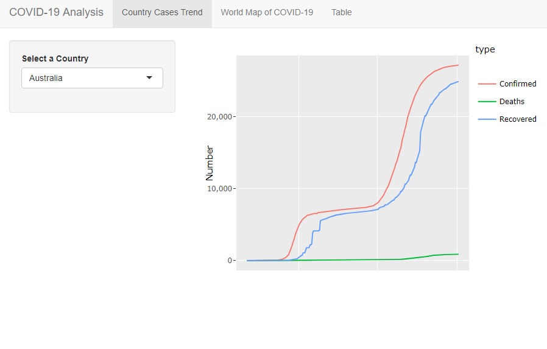
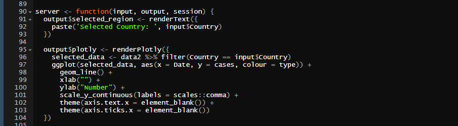
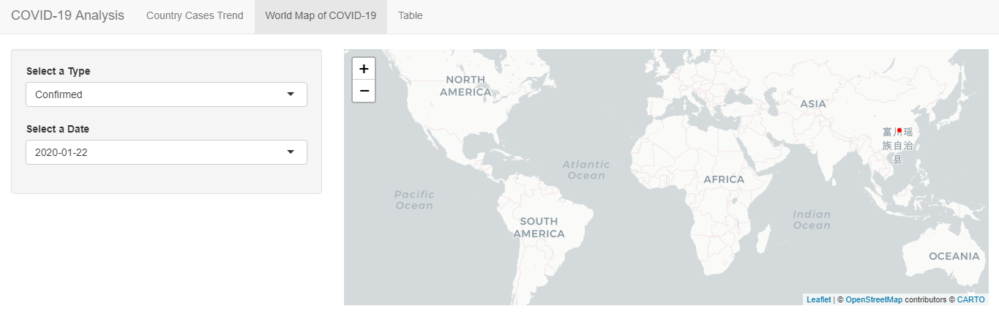
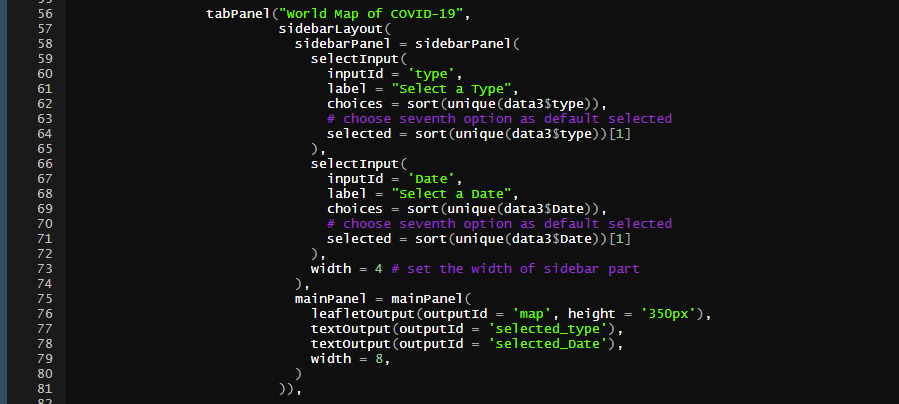
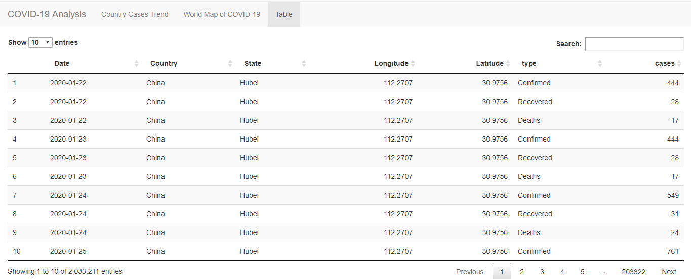

```{r setup, include=FALSE}
knitr::opts_chunk$set(echo = FALSE)
```

## Overview:

The **COVIDsen** package provides a general overview of COVID 19 cases and deaths around the world, with visualisations that involve a graph, a world map to view cases and deaths, and a table from the _DT_ package that allows us to view the pandemic in a palatable way via a _shiny_ app. This package was authored by Sen Wang, who has provided user interaction in the app to view our choice of particular countries, dates, and even confirmed and recovered cases and deaths.

## Package expectations:

The framework of R packages are specific in ways that help standardising their formation and usage. The point of having this framework is to ensure ease of understanding packages through documentation and attached functions. Following is a list of expectations for this package and a brief overview of the extent to which they were met:

1. Launch_app() - A function of **COVIDsen** that allows the user to run the app embedded in the package. Upon execution, the app indeed runs and meets expectation. 

1. UI and server functions - A refactoring of some repetitive codes in the app was done with adequate documentation, although neither of those functions were later used in the app source code.

1. inst/app folder - The app source code was nested inside the directory _inst/app/_ for ease of access to the code. Setting up a directory this way follows appropriate guidelines of making a package.

1. R CMD check - A package needs to clear certain tests to indicate validity. Github Actions provides a simple way to check the same when the package structure is pushed to the remote repository, and in this case, the author's Github page indicates that the check was completed and indicated success.

1. Documentation - There are various forms of documentation for R packages. Using the _devtools_ package, this becomes a relatively simpler process:

* Functions - The author of **COVIDsen** has successfully documented most functions and datasets used in this package with the _roxygen2_ package. Functions included in the vignette, like "filtered()" and "selected()" do not have their own documentation.

* Readme - Provides good details about the package, which includes a method of installation directly from author's Github page and a snapshot of first few rows of the main data set.

* Vignette - Contains adequate information about a general overview of the app, methods of downloading the package and launching the app, along with packages needed installed on user's system to launch the app. The document could have also included an example of some graphs, maps and their inferences in the app to give the user a glimpse of the kind of visualisations that they can expect from this package.

* Pkgdown - A pkgdown website provides comprehensive information of all elements needed to be known about a package. As mentioned above, the vignette included in the site has enough information about how to launch the app and packages that are needed to run **COVIDsen**. The "Reference" tab contains explanations regarding the functions that are provided with the package. A link to the author's Github page for the package is provided conveniently on the top-right of the site. The author has chosen a neat looking theme (darkly) by customising the _pkgdown.yaml_.

* License - A GPL-3 license was successfully included within the app.


## Suggested improvements:

1. Country cases trend - First section of the app displays country-wise information of positive cases, recovered cases and deaths upon the user selecting a country of choice through a drop-down menu. The input and output function successfully, although the axis labels and legend title are aspects of the graph that the author could improve:



* Code:



* As we can see in the first image, the x axis has no label, and even though the user may understand that the graph represents a trend, it could be more insightful if day or month information is included to identify the exact time of peaking or dropping of the curve for all countries. Therefore, line 91 "output$plotly" code could have excluded _theme(axis.text.x = element_blank)_ on line 102 and _xlab("Day/Month")_ could have been included on line 99.

* Additionally, the legend is titled "type", although the title could have been removed altogether with _theme(lengend.title = element_blank())_.

1. World map of COVID 19 - A palatable world map displays the confirmed cases and deaths, with a choice of date to select from in the drop-down menu. The map and it's source code are as below:





* Instead of selecting an input of date from a drop-down menu, as the author has coded for from line 66, we could display a time slider in the UI, by using _sliderInput("Date", "Select a date", sort(unique(...)))_. This would have resulted in a better user experience by allowing the user to drag the slider to a date of their preference and view changes in cases/deaths quicker.

* It is also observed that the world map takes a few minutes to load and is unable to display points of interest (cases/deaths) for all countries. A small suggestion here would be to generate a drop-down menu for countries like the one made by the author in the previous section, and display a map of only the country selected by the user. This way the data requirement for each visualisation request by the shiny app would be lower, and more points of interest like deaths along with cases could be viewed. RStudio has a section explaining techniques to make shiny apps faster, which the author can find [here](https://blog.rstudio.com/2020/07/21/4-tips-to-make-your-shiny-dashboard-faster/).

1. Table - A _DT_ package table was expected, and delivered:



* For ease of visualisation, a month wise aggregation could have been used instead of day-by-day cases for each state.

* We could also consider using a top 5 or top 10 states approach for each country and display select few countries, instead of displaying all states for all countries. This way the user can have an overview for all countries' top states.

## Learning summary:

1. The author has used a single dataset of 43 MB, that was later converted to a .rda file and read into the data folder. The data was then called inside the shiny app using the .rda file, which was much more convenient than the technique of running the data cleaning process every single time the app runs, that I have personally used.

1. The author has used a "darkly" theme to customise their pkgdown website, which to me personally looks more attractive than the "cerulean" theme used more often by myself.

1. The vignette contains libraries that need to be loaded inside the user's system before launching the app embedded inside **COVIDsen**, which is good practice as it gives the user sufficient preparation and removes the process of dealing with errors when launching the app.

1. The _DT_ package is a convenient method of creating tables, although it needs to be observed that excessive information on a single screen can prove to be inconvenient for the user. We should consider filtering data out in a way that a general overview can be displayed atleast at first, and then the user could have the option to explore all of the data if they are interested.

1. The author has used the NAMESPACE file to specify all imported and exported packages, to avoid package conflict inside **COVIDsen**. Importing the right packages is essential, and is a practice I will personally adopt as well.